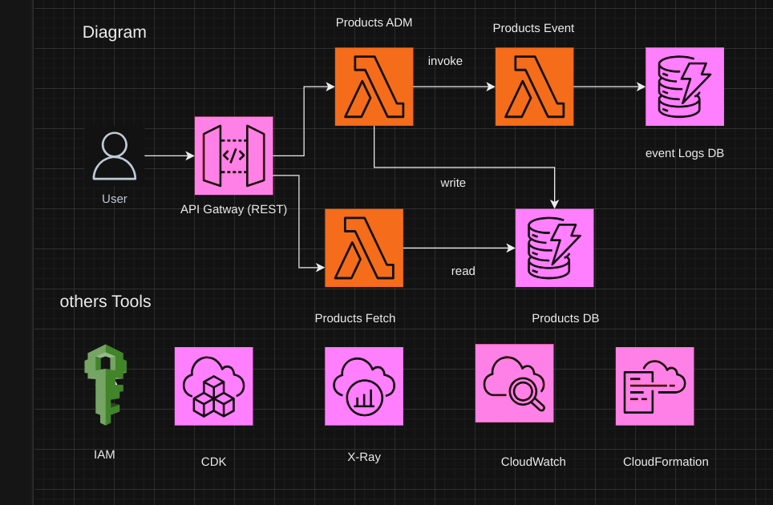

## Welcome to your CDK TypeScript project

This is a blank project for CDK development with TypeScript.

The `cdk.json` file tells the CDK Toolkit how to execute your app.

## Useful commands

- `npm run build` compile typescript to js
- `npm run watch` watch for changes and compile
- `npm run test` perform the jest unit tests
- `npx cdk deploy` deploy this stack to your default AWS account/region
- `npx cdk diff` compare deployed stack with current state
- `npx cdk synth` emits the synthesized CloudFormation template

# ECommerce

## this application contains

1 - autorization and autentication

2 - product managements

3 - order managements

4 - import of invoices

5 -

## 1 - product managemnt diagram

### First stack contain ()

products admin lambda ; products Fecth lambda; products db dinamoBD; products event Lambda

## 2 - api gateway stack (REST)

APi gateway is mport to validate uri, http method, requisitionss body e.g.

features for products, for instance ...

| request            | URL            | http verb |
| ------------------ | -------------- | --------- |
| list all products  | /products      | GET       |
| seacrh one product | /products/{id} | GET       |
| creat one product  | /products      | POST      |
| change one product | /products/{id} | PUT       |
| delete one product | /products/{id} | DELETE    |
